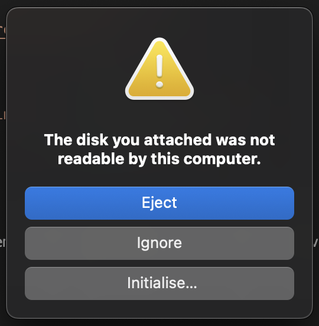

# Device copy tool
This is a tool for serialize a file to device (/dev/*) and deserialize data from device to file.

## Building
```bash
# Copy code from repository.
git clone https://github.com/AntonYurchenko/dcp.git ./dcp
cd ./dcp

# Build and add to PATH.
mkdir -p ${HOME}/.bin
go build -ldflags "-s -w" -o ${HOME}/.bin/dcp ./cmd/
echo 'export PATH=${PATH}:${HOME}/.bin' >> ${HOME}/.zprofile
source ${HOME}/.zprofile

# Test start.
dcp
# --- out ---
# dcp: only two arguments are supported.
# exit status 1
```

## Example of using
For using tool `dcp` you need a root permissions. Without command `sudo` access to any device is impossible.

### Save an archive to usb device
⚠️ WARNING ⚠️ : All data and file system on the usb device will be loss! Save important data before using this example. 
```bash
# Select a device.
diskutil list
# --- out ---
# ...
# /dev/disk4 (external, physical):
# #:           TYPE NAME               SIZE    IDENTIFIER
# 0:      USB Transcend JetDisk     *128.7 GB    disk4
# ...

# Write a tar.gz archive to USB.
sudo dcp ~/my-data.tar.gz /dev/disk4
# --- out ---
# Uploaded 134839 bytes from file "~/my-data.tar.gz" to device "/dev/disk4"

# Eject an USB disk.
diskutil eject /dev/disk4
# --- out ---
# Disk /dev/disk4 ejected
```
### Reading data from usb device to file
When you will insert usb device to your mac you will see next error message:



This is normal situation. Your usb device has no file system. Tool `dcp` writes data to device without creation of any file system. You need click `Ignore` button and continue work.
```bash
# Reading data from USB device (for example: /dev/disk4).
sudo dcp /dev/disk4 ~/my-data.tar.gz
# --- out ---
# Downloaded 134839 bytes to file "~/my-data.tar.gz" from device "/dev/disk4"

# Eject an USB disk.
diskutil eject /dev/disk4
# --- out ---
# Disk /dev/disk4 ejected
```